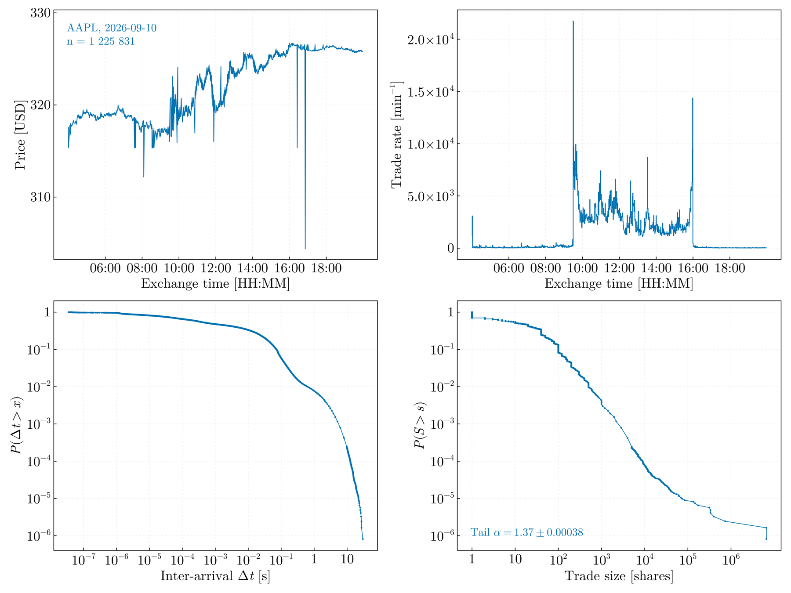

# MarketTickStreamer.jl

[](https://PaulGoG.github.io/MarketTickStreamer.jl/stable/)
[](https://github.com/PaulGoG/MarketTickStreamer.jl/actions/workflows/CI.yml)
[](https://codecov.io/gh/PaulGoG/MarketTickStreamer.jl)
[](https://github.com/JuliaTesting/Aqua.jl)
[](LICENSE)

Provider-agnostic tick-by-tick market data acquisition in pure Julia, built
for scientific time series research: live WebSocket streaming, historical
REST backfill, append-only raw persistence, compaction to analysis-ready
files, and paced replay of recorded sessions for reproducible development of
real-time analysis methods.

**[Manual](https://PaulGoG.github.io/MarketTickStreamer.jl/stable/)** ·
[Architecture](https://PaulGoG.github.io/MarketTickStreamer.jl/stable/architecture/) ·
[Configuration](https://PaulGoG.github.io/MarketTickStreamer.jl/stable/usage/) ·
[Analysis interfaces](https://PaulGoG.github.io/MarketTickStreamer.jl/stable/replay/) ·
[API](https://PaulGoG.github.io/MarketTickStreamer.jl/stable/api/) ·
[Changelog](CHANGELOG.md)

## File structure

```
.
├── Project.toml        # package environment and [compat]
├── activate.jl         # silent activation; one per environment (test/, docs/, bench/, examples/)
├── config/config.toml  # every tunable: provider, symbols, storage, limits, replay, backfill
├── src/                # the package: schema, config, sinks, quality, resample, replay, live, providers/, pipeline, visualization
├── scripts/            # entry points: stream, backfill, compact, replay, monitor, visualize
├── examples/           # worked consumers of the Channel{Trade} interface (own environment)
├── test/               # offline suite: unit, mock-server end-to-end, static QA (own environment)
├── bench/              # BenchmarkTools suite over the acquisition hot paths (own environment)
├── docs/               # Documenter manual (own environment)
└── data/, logs/, plots/  # run outputs, gitignored
```

The full tree is at the [end of this file](#full-file-tree).

## Setup

Requires Julia ≥ 1.12. No `Manifest.toml` is tracked: each environment resolves
from its `[compat]` bounds on first activation, and every capture session
stores a copy of the manifest it ran with next to its provenance sidecar. From
a clone:

```bash
julia -i activate.jl        # activates and instantiates, then leaves a REPL
```

Credentials: `cp .env.example .env`, fill in `ALPACA_API_KEY_ID` /
`ALPACA_SECRET_KEY` (free keys: https://alpaca.markets; paper-account keys
work — point `[alpaca] trading_base` at the paper endpoint, as the shipped
config does). Feeds on the free tier: `iex` (real-time, single venue) and
`delayed_sip` (consolidated tape, 15 min delayed — the default here, and
empirically print-complete against the historical tape); `sip` (real-time
consolidated) requires a paid subscription.

## Entry points

All behavior is driven by `config/config.toml`; every script accepts an
alternative config path. Each script activates and instantiates its
environment as its first statement, so a fresh clone needs no manual
environment step.

```bash
# live capture (Ctrl-C drains buffers and exits cleanly)
julia --threads=auto scripts/stream.jl

# historical backfill over [backfill.start_date, backfill.end_date]
julia scripts/backfill.jl

# compact raw session files into per-symbol per-day CSV/Arrow
julia scripts/compact.jl data/raw/<session>_part001.jsonl

# replay a recorded session as a live-like paced stream
julia scripts/replay.jl data/raw/<session>_part001.jsonl

# QA report (dupes, gaps, ordering, latency) + diagnostic figures → plots/
julia scripts/visualize.jl data/raw/<session>_part001.jsonl

# live dashboard for a running capture/backfill (separate terminal, read-only;
# tick rate, tape head/lag, per-symbol counts; --full for session totals)
julia scripts/monitor.jl

# test suite (offline: unit + mock-server end-to-end + Aqua static QA)
julia -e 'include("activate.jl"); using Pkg; Pkg.test()'

# worked consumer examples (own environment; adds OnlineStats.jl)
#   waiting times, lossless tap, every gap retained
julia examples/waiting_times.jl data/raw/<session>_part001.jsonl
#   live diagnostics, lossy tap, constant-memory sketches
julia examples/live_diagnostics.jl data/raw/<session>_part001.jsonl

# benchmark suite (own environment; slow first run while it instantiates)
julia bench/benchmarks.jl

# documentation site (own environment; output in docs/build/)
julia docs/make.jl

# regenerate the figures the README shows, from one of your own captures
julia docs/make_readme_assets.jl data/raw/<session>_part001.jsonl
```

For interactive work on individual test sets, `julia -i test/activate.jl`
opens the test environment.

From the REPL, the same entry points are `run_stream(cfg)`,
`run_backfill(cfg)`, `compact_raw(files, out)`, and
`replay_source(files)` — the latter returns a `Channel{Trade}`
indistinguishable from the live source, which is how real-time analysis
consumers are developed offline (see `docs/src/architecture.md`).

## Status

| Component | State |
|---|---|
| Live trade streaming (Alpaca IEX/SIP) | working, tested against mock |
| Binance spot adapter (public, 24/7, UTC calendar, `trade` + `aggTrade`) | working, tested against mock and validated against the live API |
| Provider-agnostic config, calendar and trading-day dispatch | working, tested |
| Reconnection, stale-connection watchdog, graceful shutdown | working, tested |
| Market-hours railings (wait-for-open, auto-stop at close, incl. half-day early close) | working, tested |
| Delayed-feed handling (railings shifted by feed delay; tape tail captured) | working, tested |
| Per-session provenance sidecars (`.meta.toml`) with a manifest snapshot | working, tested |
| Resource guards (disk space, RAM ceiling with auto-GC, channel lag, REST backoff) | working, tested |
| Crash-only session lifecycle (running/completed/interrupted/failed sidecars + startup reconciliation) | working, tested |
| Page-streaming, per-day resumable backfill | working, tested |
| Spill compaction (bounded memory for arbitrarily large raw inputs) | working, tested |
| Single-instance lock per data tree | working, tested |
| Capture-coverage cross-check against the historical tape (`coverage_report`) | working |
| Lossy-tap option in `tee` fan-out (persistence always wins) | working, tested |
| Batched raw NDJSON persistence + rolling | working, tested |
| Historical backfill (paginated REST) | working, tested against mock |
| Compaction to CSV/Arrow with duplicate removal | working, tested |
| Session QA report (dupes/gaps/ordering/latency) | working, tested |
| Diagnostic figures (price, activity, Δt & size CCDFs; HH:MM axes, decade log ticks, tail-exponent annotations) | working, inspected |
| Multi-day overview figures (trading-time price, activity heatmap, intra-session waiting-time CCDF) | working, inspected |
| Live monitoring dashboard (attach-mode, UnicodePlots) | working, tested |
| Paced replay (absolute schedule; receive or exchange clock) | working, tested |
| Quotes (`q`) / bars (`b`) normalization | working, tested — parsed to `Quote`/`Bar` with `on_quote`/`on_bar`; not subscribed or persisted by default |
| Sale-condition eligibility (`price_forming`, per-tape lists from the CTA and UTP sale-condition matrices, `n_price_forming`) | working, tested — capture is never filtered; the choice is made at analysis time |
| Resampling onto activity clocks (`tick_bars`, `volume_bars`, `dollar_bars`) | working, tested |
| Real-time analysis consumers | interface contract documented; two worked examples under `examples/`, both executed by the suite |
| Credential validation (paper account): clock REST, historical SIP REST, WS auth on `iex` and `delayed_sip` | verified 2026-08-01 |
| Live capture validation against real Alpaca feed | verified 2026-08-06: 3 h `delayed_sip` session, 24 symbols, 3.17 M ticks; QA clean (0 duplicates/out-of-order/gaps), print-complete against the historical tape |

## Output



<sub>One trading day of one symbol, rendered by `scripts/visualize.jl`: price
path and trade rate over exchange-local time, and the survival functions of
inter-arrival time and trade size. The inter-arrival distribution spans seven
decades, from sub-microsecond bursts to gaps of tens of seconds.</sub>


<sub>A recording replayed through `replay_source`, which returns the same
`Channel{Trade}` type a live session yields. A consumer written against one
runs unchanged against the other, so a real-time method can be developed and
validated offline, reproducibly, before it is pointed at the wire.</sub>

## Data layout

- `data/raw/` — append-only NDJSON, one normalized `Trade` per line,
  session-stamped filenames, size-rolled parts, never overwritten. Source of
  truth; line-by-line recoverable after a crash.
- `data/raw/<session_id>.meta.toml` — provenance sidecar per session:
  session summary, git commit, Julia/package versions, hardware fingerprint
  (CPU, memory, thread counts, `versioninfo`), full effective configuration
  snapshot.
- `data/processed/SYMBOL/YYYY-MM-DD.csv|.arrow` — compacted, time-sorted
  per-day files for the analysis pipeline. Existing files are never
  destroyed (the new file takes the canonical name; the displaced one is
  kept as a `_#N` backup).
- Timestamps are Int64 nanoseconds since the UNIX epoch (UTC) everywhere;
  `time_ns` is the exchange timestamp, `recv_ns` local receive time
  (`0` marks backfilled records).

## Testing

The suite runs fully offline: unit tests plus end-to-end runs (stream →
reconnect → fatal stop → raw files → compaction → replay) against an
in-process mock of the Alpaca REST + WebSocket APIs — no credentials or
network needed — plus static package QA via Aqua.jl.

## How to cite

Citation metadata is in [`CITATION.cff`](CITATION.cff). BibTeX:

```bibtex
@software{MarketTickStreamer_jl,
  author  = {Gogîță, Paul-Adrian},
  title   = {MarketTickStreamer.jl: provider-agnostic tick-by-tick market data acquisition and paced replay in Julia},
  version = {0.2.0},
  year    = {2026},
  url     = {https://github.com/PaulGoG/MarketTickStreamer.jl}
}
```

## Full file tree

<details>
<summary>Full file tree</summary>

```
.
├── Project.toml            # package manifest (HTTP 1.x pinned; see the architecture page §6)
├── .JuliaFormatter.toml    # committed formatting configuration (JuliaFormatter.jl)
├── .env.example            # credential template → copy to .env (gitignored)
├── activate.jl             # silent environment activation; included by every script
├── config/
│   └── config.toml         # ALL tunables: provider, symbols, storage, limits, replay
├── src/
│   ├── MarketTickStreamer.jl     # module root: imports, exports, includes
│   ├── schema.jl           # Trade struct; Int64-ns timestamps; RFC 3339 parsing
│   ├── config.jl           # TOML loading/validation; .env credential loading
│   ├── sinks.jl            # raw NDJSON sink (append-only, rolling); compaction
│   ├── quality.jl          # dedup, session QA report, disk-space probe,
│   │                       #   sale-condition (price-forming) predicates
│   ├── resample.jl         # tick / volume / dollar bars — activity clocks
│   ├── monitor.jl          # attach-mode terminal dashboard (tails raw files)
│   ├── replay.jl           # recorded-session replay source (paced or max-rate)
│   ├── live.jl             # provider-agnostic live source: reconnect, watchdog,
│   │                       #   market-close guard
│   ├── pipeline.jl         # session orchestration: run_stream / run_backfill; tee
│   ├── visualization.jl    # CairoMakie session diagnostics (price, activity, CCDFs)
│   └── providers/
│       ├── alpaca.jl       # Alpaca adapter: US equities, NY calendar, credentialed
│       └── binance.jl      # Binance adapter: crypto spot, UTC calendar, public
├── scripts/
│   ├── stream.jl           # live capture session
│   ├── backfill.jl         # historical trade download
│   ├── compact.jl          # raw NDJSON → per-symbol per-day CSV/Arrow
│   ├── replay.jl           # replay a recorded session to the terminal
│   ├── monitor.jl          # live dashboard for a running session (read-only)
│   └── visualize.jl        # QA report + per-symbol per-day diagnostic figures
├── test/
│   ├── Project.toml        # test environment; consumes the package by path
│   ├── activate.jl         # silent activation of the test environment
│   ├── runtests.jl         # unit + end-to-end tests
│   ├── mock_alpaca.jl      # in-process mock of Alpaca REST + WebSocket APIs
│   └── mock_binance.jl     # in-process mock of Binance REST + WebSocket APIs
├── examples/
│   ├── Project.toml        # examples environment (package consumed by path)
│   ├── activate.jl         # silent environment activation
│   ├── waiting_times.jl    # worked consumer: replay → tee → waiting times
│   └── live_diagnostics.jl # worked consumer: bounded-memory live statistics
├── bench/
│   ├── Project.toml        # benchmark environment (package consumed by path)
│   ├── activate.jl         # silent environment activation
│   └── benchmarks.jl       # BenchmarkTools suite over the hot paths
├── docs/
│   ├── Project.toml        # documentation environment (package consumed by path)
│   ├── activate.jl         # silent environment activation
│   ├── make.jl             # Documenter build → docs/build/
│   ├── make_readme_assets.jl  # regenerate the figures shown above, from a capture
│   └── src/                # manual: index, architecture, usage, replay, API
│       └── assets/         # the rendered figures the README and manual show
├── .github/
│   ├── dependabot.yml      # weekly dependency updates: julia, github-actions
│   └── workflows/
│       └── CI.yml          # tests (stable + compat floor + prerelease),
│                           #   formatting check, docs build & deploy
├── LICENSE                 # MIT
├── CHANGELOG.md            # release history (Keep a Changelog)
├── CITATION.cff            # citation metadata
├── data/                   # (gitignored, created on demand) raw/ + processed/
├── plots/                  # (gitignored) rendered diagnostic figures
└── logs/                   # (gitignored) per-session log files
```

</details>

## License

MIT — see `LICENSE`.
