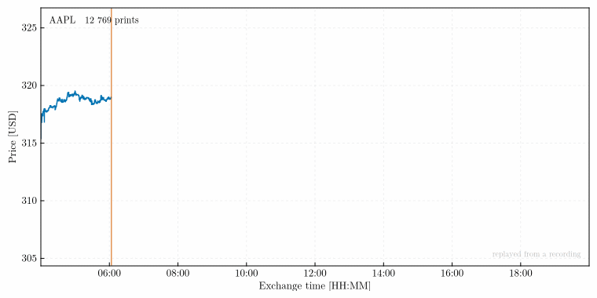

# Replay and analysis interfaces

Analysis pipelines are external to this package. What it owes them is a
stream whose contract is written down, and a way to develop against that
stream without a market being open. This page is that contract.

The pipelines this was built to feed — exact waiting-time distributions of
scalar series, long-memory estimation, criticality in tick arrival — live in
separate packages of their own, not yet released. Nothing here depends on
them, and the contract below is what any consumer gets. Two worked consumers
ship under `examples/`, and the test suite executes both, so they cannot
drift from what this page promises.



## One interface, two sources

[`live_source`](@ref) and [`replay_source`](@ref) both hand back a
`Channel{Trade}`. A consumer written against one works unchanged against the
other, which is the point: a real-time method is developed and validated on
recorded flux — reproducible, repeatable, free, available at three in the
morning — and only then pointed at the wire.

```julia
using MarketTickStreamer

# Recorded session, re-emitted at the original inter-arrival times.
ch = replay_source("data/raw/session_part001.jsonl")

for trade in ch                      # terminates when the recording ends
    # ... the analysis method under test
end
```

`pace = "max"` drops the pacing and emits as fast as the consumer takes
them, which is the mode for throughput work; `speed` compresses recorded
time, so `speed = 60.0` replays an hour of tape in a minute.

A session is replayed from its raw files, which are read whole. A corpus is
replayed from the processed tree, and streamed: the files of one trading day
— one per symbol — are loaded, merged on the clock and emitted before the
next day is opened, so a symbol-year replays in the memory of its busiest day.

```julia
files = processed_files("data/processed", "AAPL"; from = Date(2026, 5, 1))
for trade in replay_source(files; pace = "max")
    # ... an estimator run over months of tape
end
```

Six AAPL days, 5.6 million prints, go through at about a million prints per
second with the resident set flat at 1.2 GiB from the first day to the last.
Recorded pace keeps one schedule across the days, closures included, so
replaying a week at `speed = 1` takes a week. If a later day cannot be read,
the channel closes with that error and the consumer's loop rethrows it, after
every earlier print has been delivered.

## What a `Trade` means

| Field | Type | Meaning |
| --- | --- | --- |
| `symbol` | `String` | Ticker as the venue reports it. |
| `time_ns` | `Int64` | Exchange timestamp, nanoseconds since the UNIX epoch (UTC). |
| `recv_ns` | `Int64` | Local receipt timestamp, same units. **Zero for backfilled prints** — they never crossed the wire. |
| `price` | `Float64` | Trade price. |
| `size` | `Float64` | Trade size. Float rather than integer because fractional-share prints exist. |
| `exchange` | `String` | Reporting venue code. |
| `conditions` | `Vector{String}` | Sale-condition codes as reported; not filtered. |
| `tape` | `String` | Consolidated tape identifier (`A`, `B`, `C`). |
| `id` | `Int64` | Venue trade identifier, unique per venue and day. |

Two clocks per print is a deliberate choice: with `time_ns` and `recv_ns`
both recorded, feed latency is a measurable quantity afterwards rather than
an assumption baked in at capture time.

`Trade` carries value semantics — `==` and `hash` compare fields, not the
identity of the `conditions` vector — so round-tripping through the raw
layer produces objects that compare equal.

## Guarantees

**Ordering.** Replay emits in ascending order of its clock, sorted on load:
`recv_ns` when every record carries one, `time_ns` otherwise (`clock = "auto"`;
either can be forced). Backfilled records have `recv_ns = 0`, so a backfilled
recording replays on exchange time.

**Pacing.** Each emission is scheduled against the absolute time elapsed since
the first record, not slept gap by gap. `sleep` overshoots by about a
millisecond, so per-gap sleeping stretches a session whose gaps are of that
order — 65 % on gaps of 2.5 ms — whereas on an absolute schedule the error
stays within one overshoot however long the replay runs. Gaps below a
millisecond are emitted back to back, in order. The live
source emits in arrival order, which is *not* the same as ascending
`time_ns`: a consolidated tape interleaves venues, and late prints are
normal. Any method that needs monotone exchange time must sort or reject
explicitly; [`session_report`](@ref) quantifies how often it happens in a
given capture.

**Completion.** Both sources close the channel when the stream ends — the
recording exhausted, the session deadline reached, the market closed, a
fatal protocol error. A `for t in ch` loop therefore terminates on its own,
and a consumer needs no separate shutdown signal.

**Backpressure.** The channel is bounded (`limits.channel_capacity`). A slow
consumer blocks the producer, and on a live session that propagates into TCP
backpressure rather than into unbounded memory growth. This is why the
default is to block: silently dropping ticks would corrupt exactly the
arrival statistics the package exists to measure.

**Determinism.** Replaying the same files with `pace = "max"` yields the
identical sequence every time. With `pace = "recorded"` the *sequence* is
identical but the *timing* is approximate: gaps under a millisecond are not
resolvable by `sleep`, so they are emitted back to back.

## Fanning out to several consumers

[`tee`](@ref) splits one stream into independent channels, with a per-output
overflow policy:

```julia
session = live_source(provider, cfg)
persist, analyse = tee(session.channel, 2; lossy = [false, true])
```

A non-lossy output blocks the fan-out when full — use it for persistence,
which must always win. A lossy output drops incoming ticks instead of
stalling the capture, counts the drops, and reports them through `on_drop`.
An analysis tap that occasionally cannot keep up belongs on a lossy output;
one whose results depend on seeing every print does not, and should instead
run offline against the raw files, where nothing is ever dropped.

## A worked consumer

`examples/waiting_times.jl` is this page in code: it replays a recorded
session, splits it with [`tee`](@ref) into a lossless consumer and a lossy
analysis tap, accumulates inter-arrival times in a single pass, and stops
when the channel closes — no shutdown protocol of its own.

```bash
julia examples/waiting_times.jl data/raw/<session>_part001.jsonl
```

It reports both populations side by side, which is the cheapest way to see
what the choice costs on your own data. One AAPL session, 1 225 831 prints:

```
every execution          n=  1225830  mean=  0.0470 s  median=  0.0007 s  p99=  0.6231 s  max=   30.080 s
price-forming only       n=   408793  mean=  0.1409 s  median=  0.0005 s  p99=  1.4756 s  max=  116.269 s
```

A median of 0.7 ms against a mean of 47 ms is the distribution announcing
itself. Note also that excluding odd lots raises the mean roughly threefold
while leaving the median where it was: it thins the dense clusters and
stretches the tail rather than rescaling the whole distribution.

Both `tee` outputs in the example are lossless, deliberately. At maximum
replay rate a lossy tap lost 85 000 of those prints — and it does not thin a
sample evenly, it removes the bursts, which is where a waiting-time
distribution lives. Backpressure costs nothing offline, since a blocked
output only slows the replay.

The suite executes the example, so it cannot drift from the interface it
documents.

## Which prints count as trades

`conditions` is reported, never acted on at capture. Whether a print belongs
in your sample depends on the question, and the two questions this package
serves want opposite answers:

- A **price path** — returns, volatility, Hurst or DFA estimation — wants
  price-forming prints only. Odd lots, contingent and derivatively priced
  trades and corrections carry prices that were never a consolidated last
  sale, and differencing them manufactures volatility nobody could trade on.
- An **arrival process** — waiting-time distributions, tick intensity,
  criticality — wants every execution. An odd lot is a real fill by a real
  participant at a real instant, and dropping it distorts the very law under
  study.

So [`price_forming`](@ref) and [`filter_price_forming`](@ref) operate on
loaded prints, and [`session_report`](@ref) reports `n_trades` beside
`n_price_forming` so the size of the distinction is measured per capture
rather than assumed. The gap is dominated by odd lots and grows with share
price, so it varies strongly across a basket.

The default population, [`NON_PRICE_CONDITIONS`](@ref), follows the tape
plans' own sale-condition matrices: a code is excluded when the plan does not
let it update the consolidated last sale, or lets it only when it is the sole
qualifying trade of the day. That takes out odd lots, average-price prints
(`B` on tapes A and B, `W` on tape C), prices fixed earlier or elsewhere
(`P`, `4`), late reports (`Z`, `U`), contingent trades and non-regular
settlement. Extended-hours prints (`T`) stay in, because at tick resolution
they are the price path of their session. Average-price and derivatively
priced prints are few — about 3 % of what otherwise passes on a liquid
Nasdaq name — but they are the ones that land percents away from the market:
on one AAPL session they moved the day's price-forming minimum from 316.00 to
304.35. The lists are configuration
(`[quality.non_price_conditions]`), so the population a session was reported
under is recorded in its sidecar.

State which of the two populations a result used. After the fact, a price
series does not reveal it.

## Sampling on a clock that runs with the market

Market activity is not uniform in time, so sampling a price path every minute
draws unevenly from the process that generates it — densely at the open,
sparsely at lunch. [`tick_bars`](@ref), [`volume_bars`](@ref) and
[`dollar_bars`](@ref) resample a capture onto clocks that advance with
activity instead: one bar per fixed count of prints, of shares, or of traded
value.

```julia
trades = read_raw(files)
bars = dollar_bars(filter_price_forming(trades), 5.0e6)   # one bar per $5M traded
```

The empirical motivation is old and well tested: price changes sampled in
transaction time are far closer to independent and normal than calendar-time
changes ([Mandelbrot & Taylor 1967](https://doi.org/10.1287/opre.15.6.1057);
[Clark 1973](https://doi.org/10.2307/1913889);
[Ané & Geman 2000](https://doi.org/10.1111/0022-1082.00286)). Of the
three, the value clock is the one that survives a change of scale — it is
invariant to splits and roughly invariant to price drift, so a threshold
chosen on one sample still means something on another.

Two choices are yours and are not incidental. Whether to filter to
price-forming prints first changes the bar count by a factor of three on a
high-priced name. And the bars carry `recv_ns = 0`, the same marker the raw
layer uses for records that never crossed the wire, because a derived bar has
no receipt time.

A [`Bar`](@ref) records both ends of its interval: `time_ns` is the timestamp
of its first print and `close_ns` that of the print that completed it. On an
activity clock the amount transacted per bar is fixed and the duration is
what varies, so `close_ns - time_ns` is itself a waiting time — that of a
fixed quantity of activity rather than of a single print:

```julia
durations_s = [(b.close_ns - b.time_ns) / 1e9 for b in bars]
```

Consecutive bars never overlap, `bars[i].close_ns <= bars[i+1].time_ns`, and
the gap between them is the wait for the next bar's first print.

## Working from the file layer instead

For methods that need the whole record rather than a stream — tail exponents,
long-memory estimation, anything needing the sample in memory —
[`read_raw`](@ref) returns a `Vector{Trade}` from raw NDJSON, and
[`compact_raw`](@ref) writes per-symbol per-day CSV or Arrow that any other
tool can read. The raw layer is the source of truth; compaction is a
convenience over it, never a replacement.
